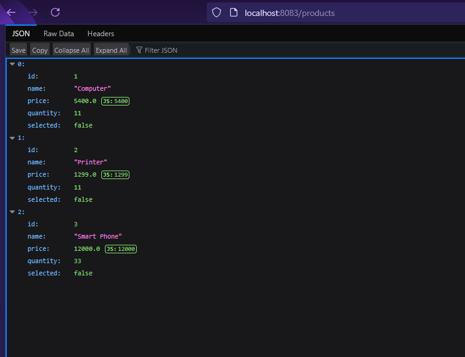

# Projet Angular


## 1. Création du projet Angular


Nous avons commencé par créer un nouveau projet Angular avec la commande suivante :

```
ng new iga-app
```
Ensuite, nous avons installé les bibliothèques bootstrap et bootstrap-icons pour styliser notre interface utilisateur :

```
ng install bootstrap bootstrap-icons
```
## 2. Configuration des styles
Nous avons ajouté les chemins nécessaires dans le fichier angular.json pour activer Bootstrap :

```json
"styles": [
  "src/styles.css",
  "node_modules/bootstrap/dist/css/bootstrap.min.css",
  "node_modules/bootstrap-icons/font/bootstrap-icons.min.css"
]
```

## 3. Génération des composants
Nous avons généré deux composants principaux :
```cmd
ng generate component accueil
ng generate component produits
```

## Configuration du Routage
Nous avons configuré le système de routage dans le fichier app.routes.ts :

```java
import { Routes } from '@angular/router';
import {Accueil} from './accueil/accueil';
import {Produits} from './produits/produits';

export const routes: Routes = [
        {path: "accueil", component: Accueil},
        {path: "produits", component: Produits}
        ];

```
## Composant Produits
Dans le composant Produits, nous avons affiché une liste de produits avec une option pour les supprimer :

```html
<div class="p-3">
    <div class="card-body">
        <h2>Produits component</h2>
        <table class="table">
            <thead>
            <tr>
                <th>ID</th>
                <th>Name</th>
                <th>Price</th>
                <th>Delete</th>
            </tr>
            </thead>
            <tbody>
            @for (p of produits; track p){
            <tr>
                <td>{{p.id}}</td>
                <td>{{p.name}}</td>
                <td>{{p.price}}</td>
                <td><button class="btn btn-danger" (click)="deleteProduct(p)">Supprimer</button></td>
            </tr>
            }
            </tbody>
        </table>
    </div>
</div>

```


Avant de connecter le backend, nous avons d’abord simulé des données localement :
```java
import { Injectable } from '@angular/core';
import { HttpClient } from '@angular/common/http';

@Injectable({
  providedIn: 'root'
})
export class Produit {
  produits = [
    {id:1,name:"Computer",price:4500},
    {id:2,name:"Phone",price:3500},
    {id:3,name:"watch",price:3000},
   ];

  constructor() { }

  getAllProducts(){
    return this.produits;
  }

  deleteProduct(produit: any): void{
    this.produits = this.produits.filter((p:any) : boolean => p.id != produit.id);
    }
}
```

Maintenant on a lancé le backend Spring pour le lier avec le front




## 6. Connexion avec l’API Spring Boot
Après avoir démarré notre backend Spring, nous avons modifié le service pour interagir avec l'API :
```java
import { Injectable } from '@angular/core';
import { HttpClient } from '@angular/common/http';

@Injectable({
  providedIn: 'root'
})
export class Produit {
    produits : any;

  constructor(private http: HttpClient) { }

  getAllProducts(){
    return this.http.get("http://localhost:8083/products");
    }

  deleteProduct(produit: any){
    return this.http.get("http://localhost:8083/products/"+produit.id);
    }
}


```
Nous nous sommes assurés que le backend accepte les requêtes CORS et que les routes des endpoints sont correctes.

